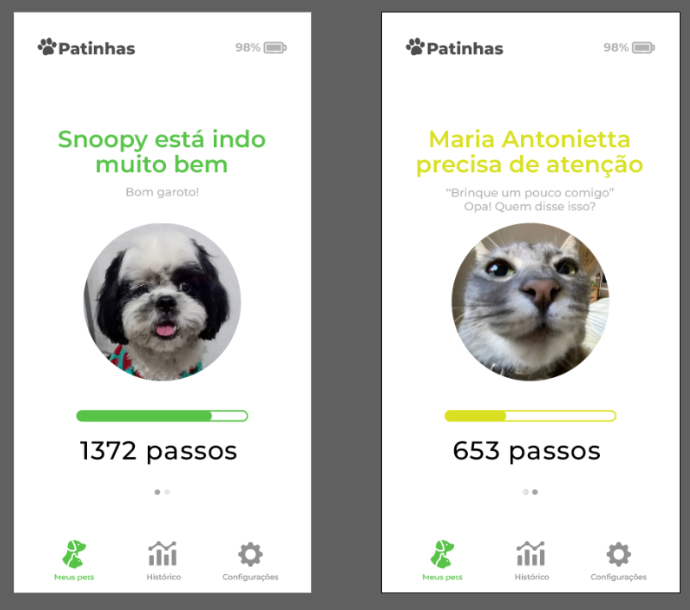

# 🐾 Projeto Patinhas - Computação Física e Aplicações

Repositório público para os integrantes do grupo da disciplina de Computação Física e Aplicações (2025) - EACH USP.

## ✏️ Resumo do projeto

Coleira ou pingente de coleira que mede o nível de atividade física de um pet. A ideia é registrar o número de passos do pet e enviar esses dados a um aplicativo mobile, onde o tutor poderá acompanhar o nível de atividade física do pet durante o dia. Ao virar do dia, a contagem reseta. Os dados sobre passos ficarão salvos em uma base de dados e poderão ser usados para criar gráficos sobre a atividade do pet.

Ilustração de exemplo:

## 🔧 Componentes

- Placa microcontroladora ESP32-C3 Super Mini OLED Display de 0.42''
- Módulo MPU-9250/6500: Este módulo contém um sensor acelerômetro de 3 eixos, um giroscópio de 3 eixos e um magnetômetro de 3 eixos
- Fonte de energia (bateria)

## 🚀 Funcionamento

1. O sensor acelerômetro capta a aceleração em três dimensões (X, Y, Z)
2. O algoritmo de detecção de passos:
   - Calcula a magnitude da aceleração nos três eixos
   - Mantém um buffer circular dos valores recentes
   - Detecta um passo quando o movimento excede a média + limite estabelecido
   - Usa lógica de temporizador para prevenir contagem duplicada de passos
4. Contagem de passos é mostrada no display do ESP32-C3 e guardada em memória flash periodicamente 
5. Ao conectar-se ao Wi-fi, o último valor captado é enviado para um banco de dados em nuvem
6. O aplicativo acessa esses dados e os exibe ao tutor
7. Ao final do dia a contagem de passos é resetada

## 📦 Dependências de software

- Arduino IDE
- Bibliotecas:
  -  [MPU9250 por hideakitai](https://github.com/hideakitai/MPU9250)
  -  (...)
  
 
## 🗣️ Dúvidas e Ajuda

Ficou interessado pelo projeto e está com alguma dúvida? Ficou perdido ou confuso? Ou quer sugerir alguma melhoria ao projeto?

Incentivamos que você nos procure. **Abra uma Issue** na página de Issues contando seu problema/sugestão.

## 👨‍💻 Autores
 
- [Arthur Hernandes](https://github.com/arthurHernandess)
- Gabriel Kennuy
- [Stefanie Palmeira](https://github.com/stepalmeira)
- [Willian Jefferson Sousa Farias](https://github.com/willianjsf)

