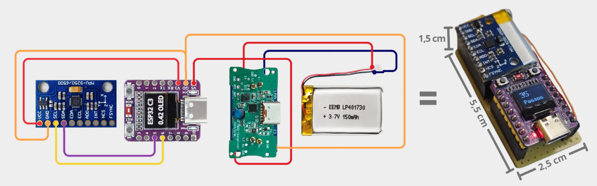
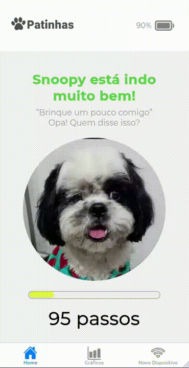
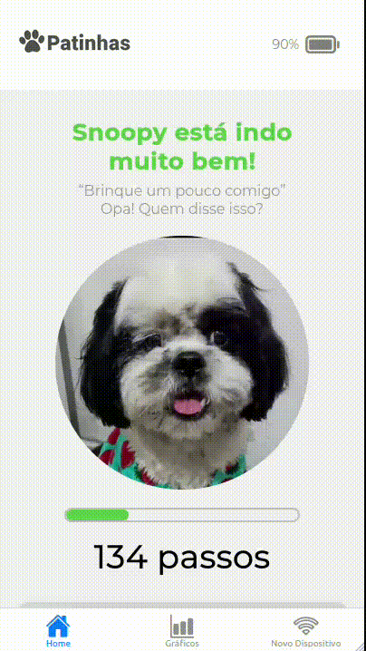

# 🐾 Projeto Patinhas

Repositório público para apresentação do projeto desenvolvido por alunos do curso de Sistemas de Informação na disciplina Computação Física e Aplicações (2025) na EACH-USP com orientação do professor doutor [Fábio Nakano](https://github.com/FNakano/CFA).

## ✏️ Resumo do projeto

Acessório de coleira que conta os passos do pet e envia essas informações para um app mobile. O tutor acompanha a atividade física diária do animal, com a contagem sendo reiniciada a cada dia. Os dados ficam armazenados em uma base para geração de gráficos e histórico de atividade.

## 🔧 Componentes

- Placa microcontroladora ESP32-C3 Super Mini OLED Display de 0.42''
- Módulo MPU-9250/6500: Este módulo contém um sensor acelerômetro de 3 eixos, um giroscópio de 3 eixos e um magnetômetro de 3 eixos
- Módulo para carregamento de bateria 
- Bateria Li-po 3.7V 300mAh
- Case de proteção

Obs.: A bateria, o módulo de carregamento e a case foram reciclados de uma caixinha carregadora de fones de ouvido bluetooth

##  🐕‍🦺 Como o algoritmo detecta passos

O algoritmo lê aceleração e rotação, filtra ruídos e usa uma máquina de estados para identificar um padrão “pico → vale”, que representa um passo. Movimentos bruscos são ignorados usando o giroscópio. Quando um passo é confirmado, ele é contado e enviado ao servidor, enquanto o display mostra o total.

## 📱 Aplicativo mobile
O app (React) consome uma API fornecida por um backend em Python, que funciona como ponte entre o ESP32 e o aplicativo. O ESP32 detecta passos, encontra o servidor automaticamente via UDP Broadcast e envia os dados em POSTs periódicos. O backend (Flask) recebe esses passos, armazena o histórico e disponibiliza os valores via HTTP para o app, que atualiza as informações do pet em quase tempo real.
Para usar o sistema, basta rodar o server.py localmente (na mesma rede do ESP32 e do celular) e abrir o app do repositório.

  
   

## 📦 Dependências de software

#### Dispositivo físico

- Arduino IDE
- Bibliotecas externas:
  -  [MPU9250 por hideakitai](https://github.com/hideakitai/MPU9250) (Comunicação com MPU9250)
  -  [U8g2lib por olikraus](https://github.com/olikraus/u8g2) (Comunicação com display)

#### Backend
- Python
- Flask 
- Zeroconf
  
#### Frontend
- Node.js
- Expo
- React Native
- TypeScript

## 🚀 Demonstração

Snoopy aprovou o projeto 👍️
 
## 🗣️ Dúvidas e Ajuda

Ficou interessado pelo projeto e está com alguma dúvida? Ficou perdido ou confuso? Ou quer sugerir alguma melhoria ao projeto?

Incentivamos que você nos procure. **Abra uma Issue** na página de Issues contando seu problema/sugestão.

## 👨‍💻 Autores
 
- [Arthur Hernandes](https://github.com/arthurHernandess)
- [Gabriel Kennuy](https://github.com/fosfro)
- [Stefanie Palmeira](https://github.com/stepalmeira)
- [Willian Farias](https://github.com/willianjsf)

