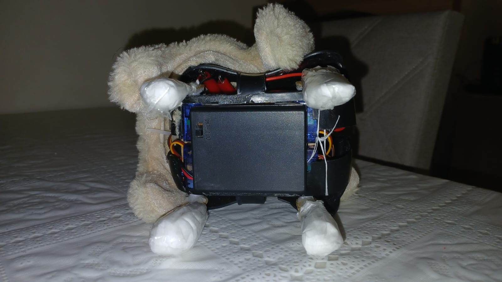

# Projeto Patinhas: monitoramento de atividade para Pets de pequeno porte

## Introdução

No cenário imobiliário atual, a verticalização das cidades tornou a vida em apartamentos mais comum do que em casas com quintais. Nesse contexto, a adoção de animais de estimação de pequeno porte tornou-se a norma. Entretanto, a restrição de espaço físico pode levar esses animais a desenvolverem um estilo de vida sedentário, condição que muitas vezes não é observada pelos tutores até que cause problemas de saúde visíveis, como obesidade, problemas articulares ou cardiovasculares.

Através da coleta de dados de movimentação (passometria) do animal, é possível transformar a percepção subjetiva do dono em dados objetivos. O "Projeto Patinhas" visa preencher essa lacuna oferecendo uma solução para monitorar a saúde física do pet.

A solução propõe um design minimalista e robusto, acoplado a um sistema de software que processa o movimento em "passos" e centraliza as informações em uma interface web acessível.

## Objetivos

**Objetivo Geral**

- Desenvolver um sistema completo de IoT (Internet das Coisas) para monitoramento de atividade física de pets.

**Objetivos Específicos**

- Hardware: Prototipar um "pingente" resiliente para acoplamento em coleira, contendo os componentes necessários. Além disso, deservolver o interior de um cachorro de brinquedo para testes e apresentação.

- Firmware: Desenvolver algoritmo para detecção de passos baseado em acelerômetro, filtrando movimentos como balançar a cabeça rapidamente.

- Conectividade: Implementar comunicação Wi-Fi para envio de dados do dispositivo para o servidor local.

- Software/Backend: Criar um webserver (API) para recepção, validação e armazenamento dos dados.

- Interface: Disponibilizar os dados para o usuário final.

## Materiais e Métodos

### Dispositivo físico

Para a construção do pingente, foram selecionados os seguintes componentes:

| Nome | Quantidade | Motivo da escolha |
| --- | --- | --- |
| Microcontrolador (ESP32-C3 Super Mini com display) | 1 | --- |
| Acelerômetro (MPU-9250/6500)| 1 |  --- |
| Bateria Li-po 3.7V 300mAh  | 1 | --- |
| ... | 1 | --- |

+ explicação da passo a passo de criação pingente e conexões

O código utilizado no ESP32C3 Super Mini está em Aplicacao/captacao_de_passos ou https://github.com/willianjsf/Patinhas-CFA/tree/main/Aplicacao/captacao_de_passos.

### Interior do cachorro de teste

Para a construção do interior do cachorro de brinquedo, foram utilizados os seguintes componentes:

| Nome | Quantidade | Como está conectado com os demais componentes |
| --- | --- | --- |
| Arduino Uno com cabo | 1 | Os pinos de 0 a 7 podem ser usados pelos servos |
| Pedaço de papelão | Um pouco maior que o Arduino | Serve como base para o arduino e servos |
| Pedaço de EVA | Do tamnho do pedaço de papelão | Fica entre o arduino e o papelão |
| Micro Servo 9g SG90 | 4 | Estão abaixo do arduino e estão ligados em uma PCI |
| Placa de ciruito impresso (PCI) | 1 (2x2,5cm) | Conecta na horizontal os pinos de 5V e GND, na vertical os pinos de sinal |
| Headers normais e 90° | 2 fileiras de 8 e 1 fileira de 8 dobrados | Conectarão aos servos e ao Arduino |
| Palitos de sorvete pequenos | 4 | Ficam conectados aos servos |
| Algodão | 4 bolinhas | No fim da perna de palito para melhorar o movimento |
| Suporte de 4 pilhas | 1 | Fonte de energia para os servos motores |
| Pilhas AAA de 1,5 V | 4 | Para colocar dentro do suporte de pilhas |
| Fita dupla face | Menos de 1m | Colar o EVA e os servos ao papelão e um suporte abaixo dos servos |
| Cola quente | 1 | Colar as pernas dos servos motores aos palitos |
| Parafusos 8mm | 4 | Conectar as pernas do servos/palitos aos servos |
| Chave Phillips | 1 | (Des)Parafusar as pernas de palitos aos servos motores |
| Etiquetas adesivas | 4 | Colocadas em volta da parte preta das entradas dos servos |

Para chegar ao resultado da imagem presente na seção de Resultados, siga os passos a seguir:

1. Com um pedaço de papelão de comprimento um pouco maior que o tamanho do Arduino Uno, pegue um pedaço de EVA de mesmo tamnho que o papelão e cole os dois.
2. Cole o Arduino ao pedaço de EVA com fita dupla face.
3. Retire todas "perninhas" dos 4 servos.
4. Cole com fita dupla face os 4 servos motores embaixo do papelão, sendo 1 em cada canto e cada um com seu eixo apontando para fora (pois nós conectaremos as pernas depois).
5. Em uma placa de circuito impresso de tamanho aproximado de 2x2,5 cm solde com headers duas fileiras na horizontal (uma será para 5V que ficará no meio e outra para GND que ficará na parte supeior), essas duas fileiras podem ser 3ª e a 2ª fileira da placa.
6. Ainda na placa, solde os caminhos verticais (caso eles não estejam conectados) saindo da fileira de headers abaixo da fileira de 5V e indo até o último furo na vertical. Nesses últimos furos da placa coloque uma fileira de headers dobrados 90° para se conectar com os pinos do Arduino.
7. Conecte a PCI aos pinos 8-13 do Arduino Uno.
8. Identifique o nome de cada servo com etiquetas adesivas ao redor das entradas dos servos.
9. Conecte os servos aos headers da PCI corretamente (fio marrom mais acima e fio amarelo/laranja mais abaixo) aos pinos do Arduino (veja no código cachorroArduino/movimentoCachorro quais pernas vão em quais pinos).
10. Pegue o último pino da fileira de 5V e da fileira de GND e entorte um pouco para fora.
11. Pegue o suporte de pilhas com as pilhas dentro e solde o final do fio vermelho (descapado) ao pino da fileira e 5V e faça o mesmmo para o fio preto com o pino da fileira de GND (mesma fileira dos fios marrons dos servos).
12. Cole com fita supla face o suporte de pilhas embaixo dos servos.
13. Faça um furo em uma ponta do palito e, com cola quente, cole as "perninhas" do servo no palito de modo que os furos fiquem alinhados e "perninha" apontando para o chão.
14. Parafuse os parufusos nos furos das pernas em cada servo.
15. Coloque um pouco de algodão na ponta de cada perna e enrole com fita duréx.

Está pronto o esqueleto do seu cachorro!

Caso você queira colocar dentro da pelúcia, só parafuse as pernas depois de colocar o corpo do cachorro dentro da pelúcia (deixe as portas de alimentação para a traseira do cachorro).

O código utilizado para que a estrutura do cachorro se mexa está presente em: https://github.com/willianjsf/Patinhas-CFA/blob/main/cachorroArduino/movimentoCachorro.ino.

Para que o cachorro comece a se mexer, basta alimentar o Arduino Uno com o cabo USB conectado em seu computador e ligar o suporte de pilhas.

### App

O aplicativo está disponível neste repositório:
https://github.com/arthurHernandess/CFA-patinhas-app

O backend em python serve como “ponte” entre o hardware e o app — recebe dados do ESP32 (passos), mantém o estado / histórico e disponibiliza uma API para o app consultar. 
Isso permite que o app apenas consuma os dados sem se preocupar com hardware. Consumindo dados enviados pelo ESP32 e mostrando ao usuário o número de passos do “pet” em tempo quase real

1. O ESP32 encontra automaticamente o servidor na inicialização (UDP Broadcast) --> O ESP envia DISCOVER_SERVER para a rede. O Servidor responde com SERVER_IP:<ip>
2. O ESP32 detecta passos usando o algoritmo embarcado
3. O ESP32 acumula os passos por tempo ou quantidade, a cada 30 segundos envia um POST
4. O servidor backend recebe os POSTs do firmware, armazena os dados (passos) e disponibiliza via rota HTTP para o app cliente.
5. O app mobile consome essa API, a cada 30 segundos, para obter dados de passos e exibe para o usuário.

Para o desenvolvimento do aplicativo foi utilizado React por sua agilidade, e capacidade de componentização
O servidor local roda em python usando flask para lidar com requests HTTP, POST para recebimento dos passos do ESP32 e GET para o envio para o APP, e usando json para formatação dos dados

Para utilizar o app e servidor é nescessario utilizar Python para rodar o script server.py em sua maquina local, que deve estar conectada no mesmo wifi do ESP32 (por hora hardcoded no .ino) e do dispotivio que ira rodar o app

## Resultados

--> Imagem dos compoenetes soldados na placa

Algumas imagens do processo de montagem do cachorro utilizando Arduino Uno:

--> imagens reais do app

## Conclusões e Comentários

O Projeto Patinhas atingiu o objetivo de criar um sistema funcional de monitoramento da atividade física do Pet através do cálculo da quantidade de passos do Pet.

### Comentários

A experiência da realização do projeto foi proveitosa e aprendemos muito em todas as etapas da contrução do projeto.

Em relação à *side quest* de desmontar um cachorro de pelúcia que se movimentava um pouco para frente e dava cambalhotas, demandou mais tempo do que pensávamos que demoraria, a maior dificuldade foram referentes à fonte de alimentação e fazer o cachorro andar corretamente.

No resultado final ele anda bem pouco e não como gostaríamos, acreditamos que em parte seja devido as pernas serem constituídas de palitos retos que não possuem dobraduras para simular um joelho, e outro aspecto seria o revestimento de pelúcia que faz com que ele deslize e não consegue pegar impulso suficiente para ir para frente.

Como melhoria futura, sugere-se a melhoria/implementação de:

- Melhorar a movimentação das patas do cachorro feito com Arduino Uno para que se movimente corretamente em superfícies lisas e planas, sendo através da criação de "joelhos" ou melhorando o contato da pata com a superficie.

## Integrantes
 
- [Arthur Hernandes](https://github.com/arthurHernandess)
- [Gabriel Kennuy](https://github.com/frosfo)
- [Stefanie Palmeira](https://github.com/stepalmeira)
- [Willian Jefferson Sousa Farias](https://github.com/willianjsf)
